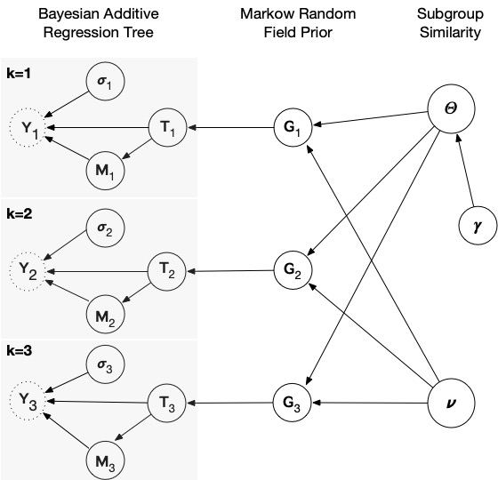

# Joint Bayesian Additive Regression Tree

Joint Bayesian Additive Regression Tree (JointBART) is a general and flexible model for nonlinear joint graph
inference that is well-suited for complex distributions of genomic data.



## Installation 
To install the package:
```
library(devtools)
install_github("licaih/jointBART", dependencies=TRUE)
```

Alternatively, you can install the pre-build R package: 
```
$ R CMD INSTALL jointBART_0.1.2.tar.gz
```

## Example

Simulate data: 
```
rm(list = ls())

K     = 4           # number of subtypes
p     = 50          # number of nodes
SDreg = 1           # error term
n     = rep(100, K) # sample size of training set
np    = rep(25, K)  # sample size of testing set

set.seed(2023)

# similar coefficients
coefInd = list()
coefInd[[1]] = 1:5
coefInd[[2]] = 2:6
coefInd[[3]] = 4:8
coefInd[[4]] = 6:10

x = lapply(n + np, function(ni) matrix(runif(ni*p), ni, p))

fun1 <- function(x, coInd){
  n    = nrow(x)
  y    = rep(0, n)
  vecA = rep(0, n)
  y    = 10*sin(pi*x[, coInd[1]]*x[, coInd[2]]) +
    20*(x[ , coInd[3]] - .5)^2 + 10*x[ , coInd[4]] + 5*x[ , coInd[5]]
  y = y + rnorm(n, sd = SDreg)
  return(y)
}

y = lapply(1:K, function(k) fun1(x[[k]], coefInd[[k]]))

x.train = mapply(function(xi, ni) xi[1:ni, ], x, n,SIMPLIFY = F)
y.train = mapply(function(xi, ni) xi[1:ni], y, n, SIMPLIFY = F)
x.test  = mapply(function(xi, ni) xi[(nrow(xi)-ni+1):nrow(xi), ], x, np,SIMPLIFY = F)
y.test  = mapply(function(xi, ni) xi[(length(xi)-ni+1):length(xi)], y, np,SIMPLIFY = F)
```

To run the package:
```
library(jointBART)

my_w       = 0.5   # prior on pairwise group similarity
graph_a    = 1     # variable-specific prior beta(a, b)
graph_b    = 9     
adj_alpha0 = 0.05  # selection probabilities under the Dirichlet prior 
adj_alpha1 = 1     

adj   = matrix(0, p, K)   # vector of binary indicator of whether a corresponding variable is important
Theta = matrix(0.1, K, K) # pairwise group similarity
diag(Theta) = 0

graph_nu = rep(0, p) # variable-specific prior probability of relevance

ntree = 20L # number of trees

res = JointWBart(x.train = x.train, y.train = y.train, x.test = x.test,
                 Theta = Theta, adj = adj, graph_nu = graph_nu,
                 graph_alpha = 2, graph_beta = 5,
                 graph_a = graph_a, graph_b = graph_b, my_w = my_w,
                 ntree = ntree, ndpost = 1e4, nskip = 5e3,
                 adj_alpha0 = adj_alpha0, adj_alpha1 = adj_alpha1)

pip = apply(res$varcount>0, c(3,2), mean)
```

Posterior inclusion probability:
```
pip[1:4, 1:10]
```
```
       [,1]   [,2]   [,3]   [,4]   [,5]   [,6]   [,7]   [,8]   [,9]  [,10]
[1,] 1.0000 1.0000 1.0000 1.0000 1.0000 0.0352 0.0152 0.0175 0.0143 0.0175
[2,] 0.0278 1.0000 1.0000 1.0000 1.0000 1.0000 0.0984 0.0383 0.0230 0.1229
[3,] 0.0250 0.0696 0.0482 1.0000 1.0000 1.0000 1.0000 1.0000 0.0299 0.1401
[4,] 0.0385 0.0683 0.0375 0.0563 0.0685 1.0000 1.0000 1.0000 1.0000 1.0000
```

Pairwise group similarity:
```
apply(res$theta_all>0, c(2,3), mean)
```
```
       [,1]   [,2]   [,3]   [,4]
[1,] 0.0000 0.7552 0.5440 0.3859
[2,] 0.7552 0.0000 0.6742 0.4753
[3,] 0.5440 0.6742 0.0000 0.6538
[4,] 0.3859 0.4753 0.6538 0.0000
```

